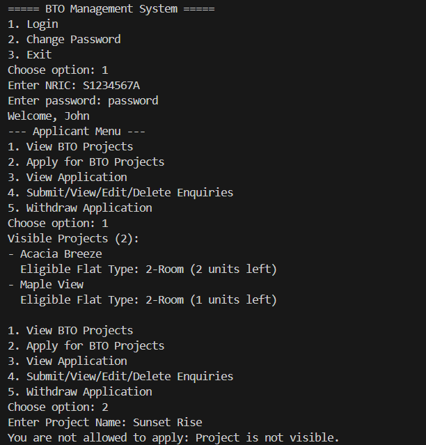
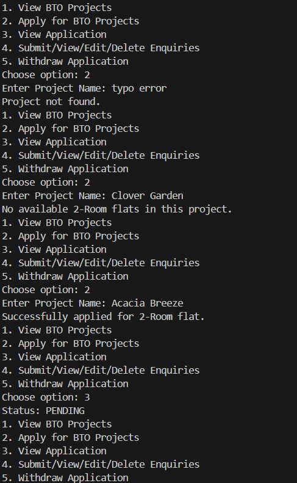

This document outlines the key features tested in the system, the test cases executed, and the results. Screenshots are included to illustrate successful runs and edge case handling.

# Features 

## Test Case 4: Password Change Functionality 
User can change their password

## Test Case 5: Project Visibility Based on User Group and Toggle

Added "Visibility" column to the csv. This is because Prof say the update of data (visibility toggled from off to on or vice versa / change of password) must be saved even after the program exits. so adding a "Visibility" column to the csv can help in saving the true / false value to the csv directly.

Added a few other projects to the original list to support this test case. Projects added must have a variety

in terms of visibility 
- true
- false

in terms of flat types
- 2 rooms, 3 rooms 

Users can only view the projects and flat types based on the project's visibility, the user's marital status and age

.png)
.png)

# Test case 6: Project Application 
- only tested for applicant so far (John)
- tested only whether the John can apply the projects he is eligible for, but whether or not the project has been really applied (via checking of application status) needs to be further verified 

