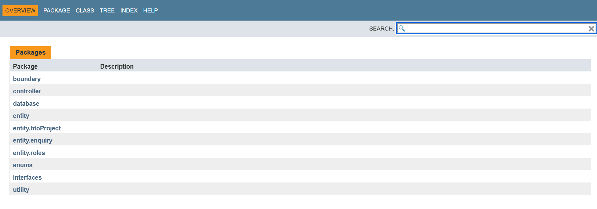
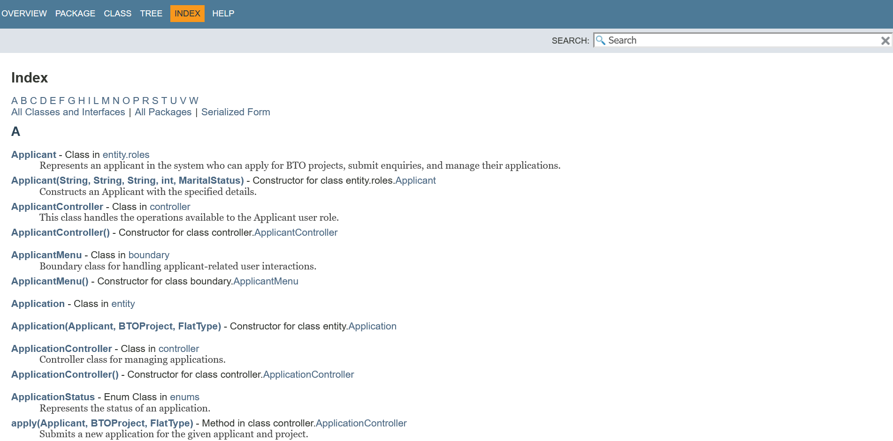

# SC2002-Assignment-
Lab: FCS1
Group: 3 

### Group Members:
- Cher Yue Yang
- Goh Jia Hui
- Jack Tan Xin Jie
- Tan Wei Song Russell Bryan

---
Features
For Applicants

    View available BTO projects
    Apply for BTO flats
    Submit enquiries
    Track application status
    Withdraw applications
    View application history

For HDB Officers

    View assigned projects
    Process applications
    Reply to enquiries
    Manage flat bookings
    View project details
    Register for project handling

For HDB Managers

    Create and manage BTO projects
    Assign officers to projects
    Approve/reject applications
    Manage project visibility
    Process withdrawal requests
    Generate reports

System Features

    Secure authentication system
    Role-based access control
    Data persistence using CSV files
    Real-time status updates
    Comprehensive error handling
    User-friendly interface

## How to Run the Application:
Run the `Main.java` file located at `src/Main.java` to start the application.

### Java Doc 
Run the `index.html` file located at `javaDoc` folder 

